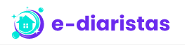

# Projeto e-diaristas

 

  

O projeto ediaristas foi desenvolvido em conjunto com os professores [Akira Hanashiro](https://github.com/hanashiro) e [Fagner Pinheiro](https://github.com/fagnerpsantos), enquanto participava do evento online: Semana MultiStack - Workshop, realizado pela [TreinaWeb](https://www.treinaweb.com.br/?gclid=Cj0KCQjwtrSLBhCLARIsACh6Rmi3DGUvzdSSAIIUuiO5q3WNbePfaEsLayAvcEtfEdu42vP3KHLriCgaAnhsEALw_wcB).

## Sobre o projeto:

A proposta do projeto era desenvolver o "começo" de uma aplicação multi-stack, com uma interface web e mobile, conectados a uma API, onde as diaristas poderiam realizar um cadastro no app, e os clientes poderiam encontrar os profissionais que estão disponíveis perto de sua localização.

## O que aprendi?

- Importar e exportar funções de arquivos distintos
- Integrar uma API a um banco de dados (SQLite no DBeaver)
- Bootstrap para estilização

## Linguagens utilizadas:

- HTML
- CSS
- JavaScript
- TypeScript
- Python

## Algumas libs e frameworks utilizadas:

- React
- React Native
- Next.js
- Axios
- Expo
- Django

## Ferramentas utilizadas:

- [Visual Studio Code](https://code.visualstudio.com/)
- [Node.js]](https://nodejs.org/en/)
- [PyCharm](https://www.jetbrains.com/pt-br/pycharm/download/#section=windows)
- [DBeaver](https://dbeaver.io/download/)
- [Insomnia](https://insomnia.rest/download)

<!--## Links para as seções do projeto
- [Front-end]()
- [Back-end]()
- [Mobile]()
-->

---

  
  

