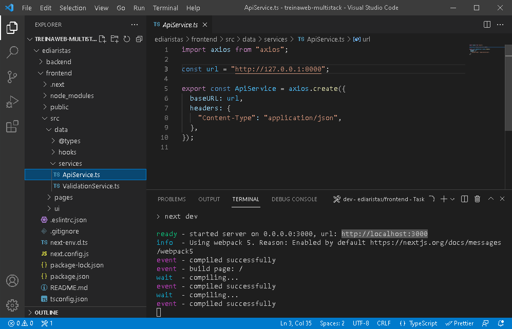
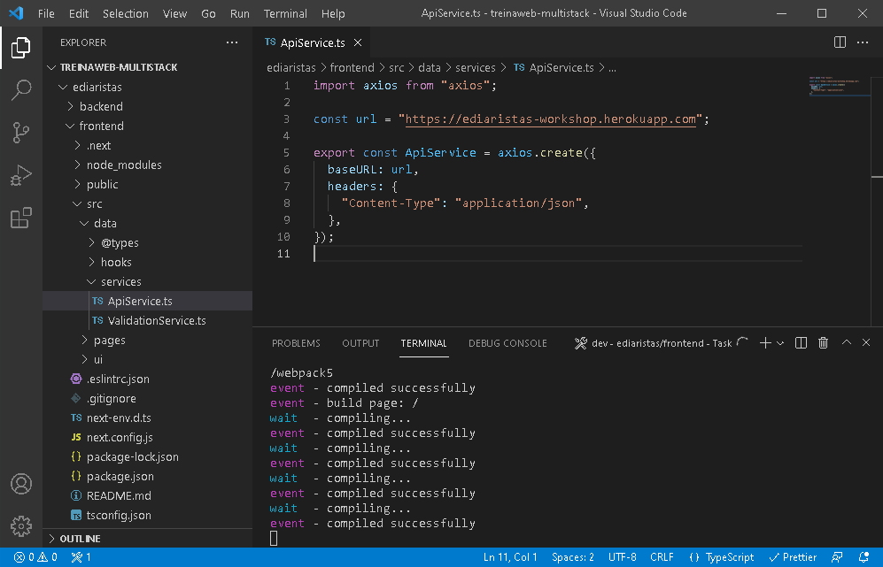

Esta parte do projeto foi desenvolvido com a linguagem [Python](https://www.python.org/) juntamente com o framework [Django](https://www.djangoproject.com/).

## Começando...

Primeiro, você pode iniciar o servidor de desenvolvimento no terminal:

```bash
python manage.py runserver
```

Abra `http://127.0.0.1:8000/web/cadastrar_diarista` ou `http://127.0.0.1:8000/web/listar_diaristas` com o seu navegador. </br>

Nestas áreas, você pode cadastrar diaristas ou listá-las, respectivamente. </br>

Na parte do front-end e mobile, você pode configurar para acessar a API que está no seu computador (essa parte do back-end), com o seguinte endereço no arquivo "ApiService.ts": `http://127.0.0.1:8000`.

<p align="center">
    
</p>

Ou pode acessar a API que está armazenada no [Heroku](https://www.heroku.com/), com o seguinte endereço: `https://ediaristas-workshop.herokuapp.com`.

<p align="center">
    
</p>

Lembrando que `ApiService.ts` se localiza, tanto no front-end quanto mobile, em: \*/src/data/services/ApiService.ts

## Aprenda mais

- [Documentação do Python 3](https://docs.python.org/3/) - leia sobre Python e seus recursos.
- [Documentação do Django](https://docs.djangoproject.com/en/3.2/) - leia sobre Django e seus recursos.
