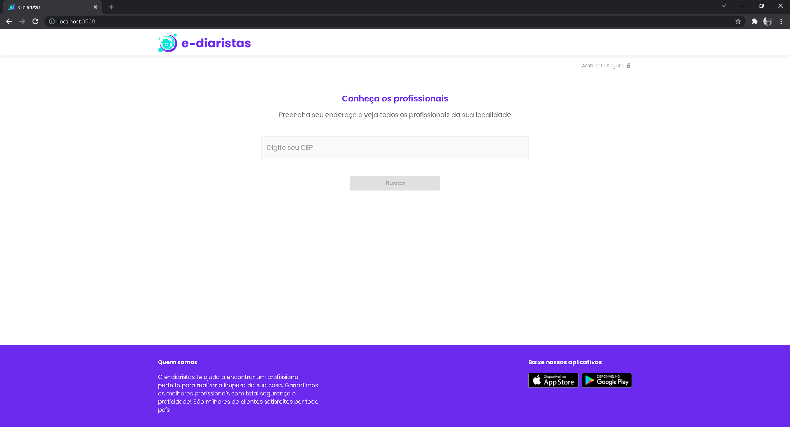
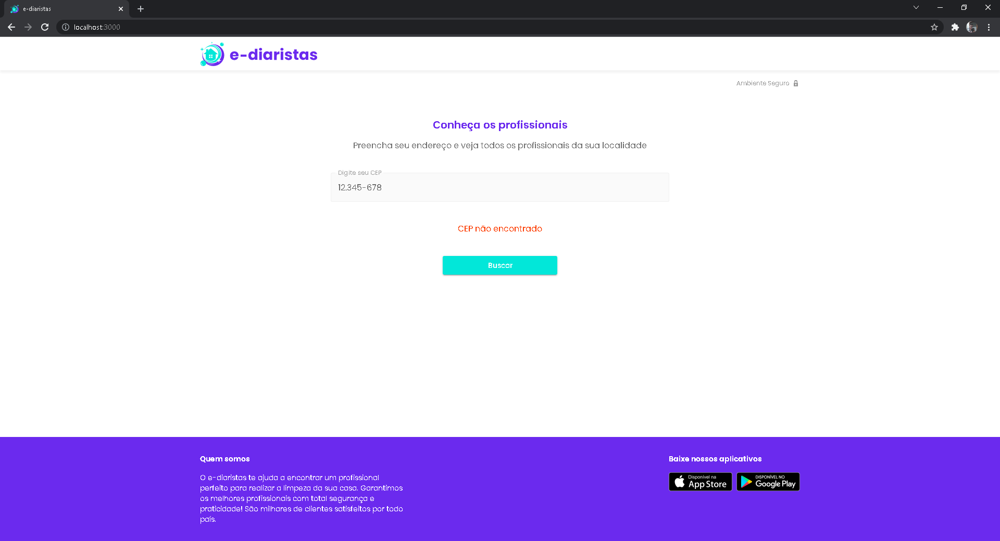
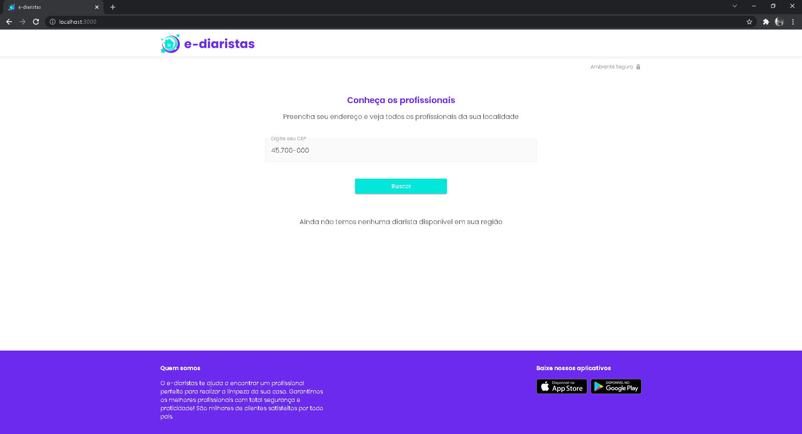
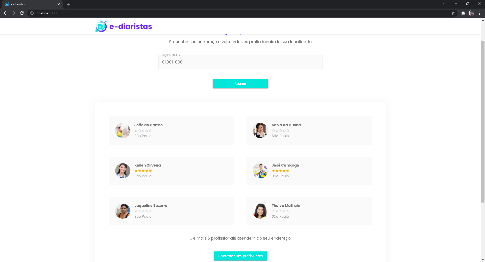

Este é um projeto [Next.js](https://nextjs.org/) inicializado com [`create-next-app`](https://github.com/vercel/next.js/tree/canary/packages/create-next-app).

## Começando...

Primeiro, execute o servidor de desenvolvimento:

```bash
npm run dev
# or
yarn dev
```

Abra [http://localhost:3000](http://localhost:3000) com o seu navegador para acompanhar as modificações. </br>

<p align="center">
    
</p>

Você pode começar a editar a página modificando `pages/index.tsx`. A página é atualizada automaticamente conforme você edita o arquivo.

[API routes](https://nextjs.org/docs/api-routes/introduction) pode ser acessado em [http://localhost:3000/api/hello](http://localhost:3000/api/hello). Este 'endpoint pode ser editado em' `pages/api/hello.ts`.

O diretório `pages/api` é mapeado para `/api/*`. Os arquivos neste diretório são tratados como [API routes](https://nextjs.org/docs/api-routes/introduction) em vez de páginas React.

## Alguns testes

Podemos fazer alguns testes usando a API da TreinaWeb que está armazenada no [Heroku](https://www.heroku.com/) (basta olhar nas instruções do [Back-end]() para acessar a esta API). Observação: podes fazer esses testes no mobile também. </br>
CEPs para teste:

- 01.001-000
- 45.700-000
- 12.345-678 </br>

<p align="center">
    
</p>
<p align="center">
    
</p>
<p align="center">
    
</p>

## Aprenda mais

Para saber mais sobre Next.js, dê uma olhada nos seguintes recursos:

- [Documentação Next.js](https://nextjs.org/docs) - leia sobre Next.js recursos e API.
- [Aprenda Next.js](https://nextjs.org/learn) - um tutorial Next.js interativo.

Você pode verificar [o repositório Next.js no GitHub](https://github.com/vercel/next.js/) - seus comentários e contribuições são bem-vindos!

## Deploy na plataforma Vercel

A maneira mais fácil de implantar seu aplicativo Next.js é usar o [Vercel](https://vercel.com/new?utm_medium=default-template&filter=next.js&utm_source=create-next-app&utm_campaign=create-next-app-readme) dos criadores do Next.js.

Confira a [documentação de implantação Next.js](https://nextjs.org/docs/deployment) for more details.
