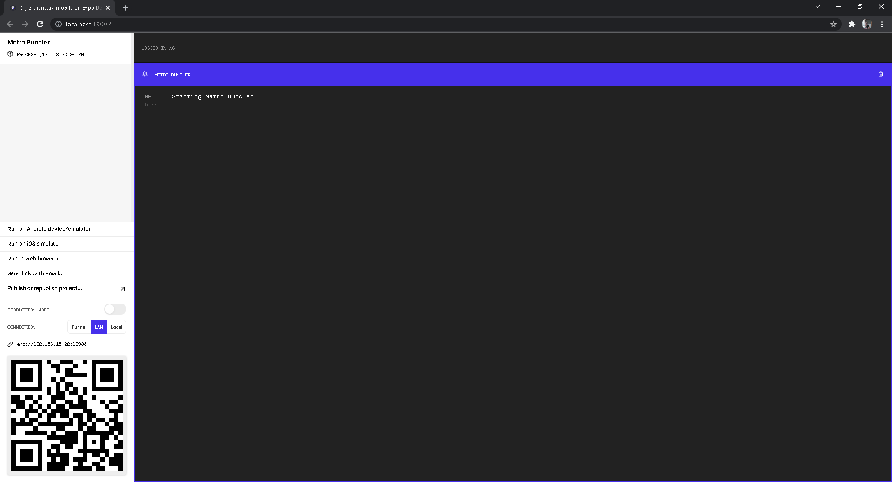
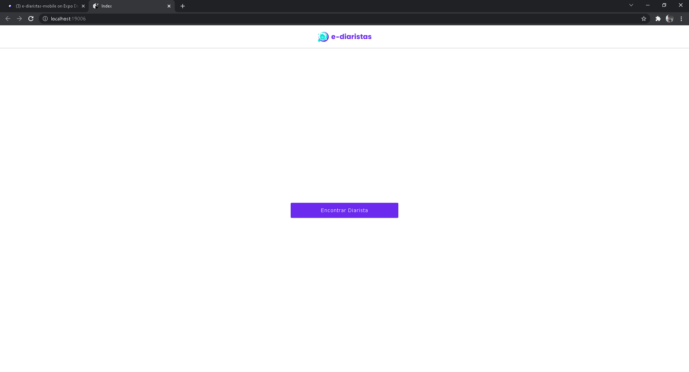

Este projeto foi desenvolvido com [Expo](https://expo.dev/).

## Começando...

Primeiro, inicie o servidor de desenvolvimento no terminal:

```bash
npm start
```

Abrirá uma guia no seu navegador com o endereço: [http://localhost:19002/](http://localhost:19002/). </br>

<p align="center">
    
</p>

Baixe o aplicativo da [Expo Go](https://play.google.com/store/apps/details?id=host.exp.exponent&hl=pt_BR&gl=US) no seu celular (para Android), ou abra a câmera (para IOS), e escaneie o QR Code. Isso abrirá o seu projeto no seu celular, para acompanhar o desenvolvimento.

Ou se você preferir, pode abrir também no navegador, clicando em `Run in web browser`. Com isso, abrirá outra guia automaticamente, com o projeto mobile funcionando no endereço `http://localhost:19006/`. </br>

<p align="center">
    
</p>

## Aprenda mais

- [Documentação do Expo](https://docs.expo.dev/) - leia sobre o Expo e seus recursos.
